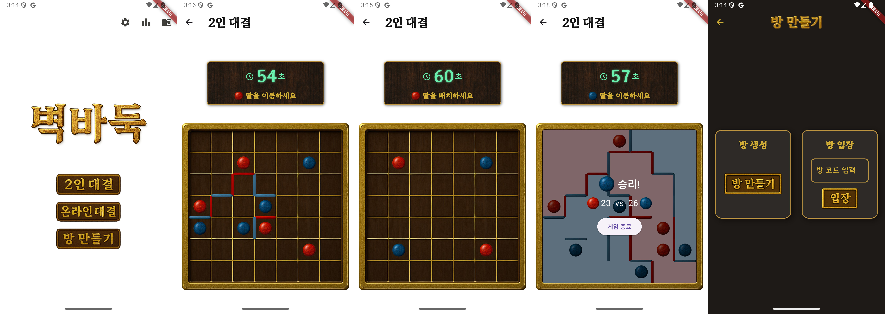

# 벽바둑 (Wall Baduk)
Flutter project.

**2인 전략형 보드 게임**  
7×7 보드 위에서 말(돌)과 벽을 이용해 영역을 확보하는 두뇌 대결

## 🎮 주요 기능

- 🧠 **2인 대결 모드**: 한 기기에서 친구와 번갈아가며 전략을 겨루세요.
- 🌐 **온라인 플레이** *(베타)*: 방 만들기/입장 기능을 통해 친구와 온라인 대전.
- 🏁 **빠른 전개와 즉시 종료**: 각 플레이어의 말이 벽으로 막혀 영역이 분리되면 게임 종료!
- 🎨 **커스텀 스킨(예정)**: 다양한 테마의 보드·말·벽 스킨 제공 예정.

## 📜 게임 규칙 요약

1. **초기 배치**  
   - A 플레이어: (1,1), (6,6), 나머지 2개는 자유 배치  
   - B 플레이어: (6,1), (1,6), 나머지 2개는 자유 배치  

2. **턴 진행**  
   - 말 하나를 상하좌우로 1~2칸 이동 (벽이 있으면 불가)  
   - 이동 후, 해당 말의 네 면 중 하나에 벽 설치  
   - 90초 내에 완료해야 하며, 초과 시 벽은 랜덤 배치  

3. **게임 종료**  
   - 각자의 영역이 완전히 분리되면 즉시 종료  
   - 각 플레이어 말이 차지한 영역의 칸 수로 승부 결정  

## 🧪 비공개 테스트 안내

플레이스토어 출시 전 **14일간 비공개 테스트**를 진행합니다.  
아래 링크를 통해 이메일을 제출하고, 테스트에 참여해 주세요!

👉 [비공개 테스트 신청하기](https://forms.gle/iydJLD2AUh19R1Hm9)

> 테스트 기간 동안 앱을 설치한 상태로 몇 번 플레이해주시면 됩니다.  
> 오류나 제안은 gue707@naver.com 를 통해 보내주세요.

## 🚀 향후 업데이트 예정

- ✅ **랭킹 시스템 및 매치 기록**
- ✅ **온라인 대전 정식화**
- ✅ **다양한 테마 스킨**
- ✅ **UI 개선**

## 📱 지원 플랫폼

- Android (Play Store 비공개 테스트 진행 중)
- iOS (출시 검토 중)

---

© 2025. 벽바둑 개발팀